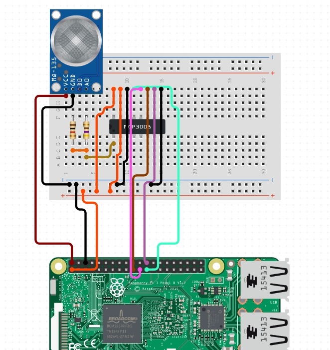

# QuickStart
給住在陽明山附近電器常常被弄壞的可憐人


## 1. 環境
### 1.1 樹梅派作業系統版本
```
PRETTY_NAME="Debian GNU/Linux 12 (bookworm)"
NAME="Debian GNU/Linux"
VERSION_ID="12"
VERSION="12 (bookworm)"
VERSION_CODENAME=bookworm
```
### 1.2 內核版本
```
Linux raspberrypi 6.6.62+rpt-rpi-v8 #1 SMP PREEMPT Debian 1:6.6.62-1+rpt1 (2024-11-25) aarch64 GNU/Linux
```
### 1.3 debian發行版本
```
12.8
```
### 1.4 硬體版本
```
processor       : 0
BogoMIPS        : 38.40
Features        : fp asimd evtstrm crc32 cpuid
CPU implementer : 0x41
CPU architecture: 8
CPU variant     : 0x0
CPU part        : 0xd03
CPU revision    : 4

processor       : 1
BogoMIPS        : 38.40
Features        : fp asimd evtstrm crc32 cpuid
CPU implementer : 0x41
CPU architecture: 8
CPU variant     : 0x0
CPU part        : 0xd03
CPU revision    : 4

processor       : 2
BogoMIPS        : 38.40
Features        : fp asimd evtstrm crc32 cpuid
CPU implementer : 0x41
CPU architecture: 8
CPU variant     : 0x0
CPU part        : 0xd03
CPU revision    : 4

processor       : 3
BogoMIPS        : 38.40
Features        : fp asimd evtstrm crc32 cpuid
CPU implementer : 0x41
CPU architecture: 8
CPU variant     : 0x0
CPU part        : 0xd03
CPU revision    : 4

Revision        : a020d3
Serial          : 00000000bf5ed724
Model           : Raspberry Pi 3 Model B Plus Rev 1.3

```

## 2. 準備
- 樹梅派3b+
- MQ-135
- MCP3008
- 1W 470歐姆電阻
- 1W 1K歐姆電阻
- tapo p100 智能插座

## 3. 安裝硬體


## 4. 設定樹梅派
### 4.1 啟動SPI 介面
找到SPI選項 啟用他
```
sudo raspi-config
```
### 4.2 樹梅派開機時啟用SPI (mcp3008)
```
sudo vi /boot/config.txt
```

文件中最下面一行加入
```
dtparam=spi=on
sudo reboot
```
	
### 4.3 安裝 Python SPI Wrapper	
```
sudo apt-get install -y python-dev-is-python3
sudo apt-get install -y python3-spidev
```

## 5. git clone
clone 完專案, pip install 安裝缺少的依賴

Sensor.py : 偵測空氣中硫化氫的含量

SmartSocket.py : 啟動或關閉插座的電源

修改程式碼 當感應器偵測到空氣中硫含量大於多少ppm時，啟動插座電源
插座上看是要接可以去除硫化物的空氣清淨機還是電風扇、除濕機